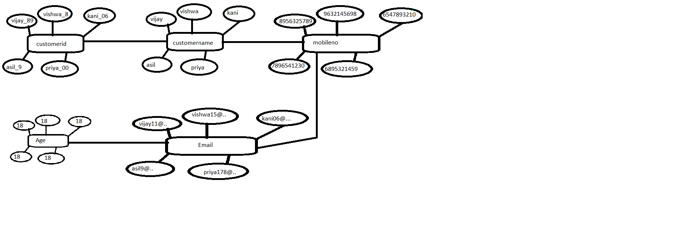
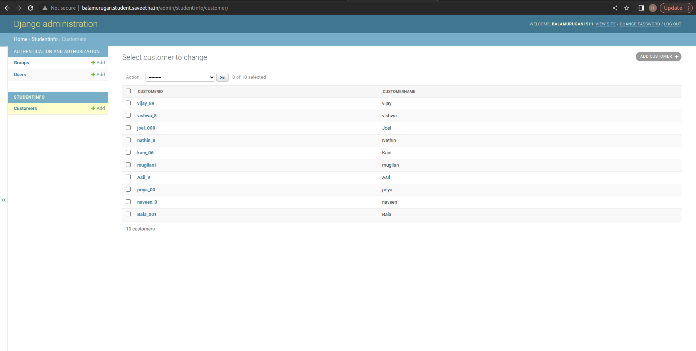
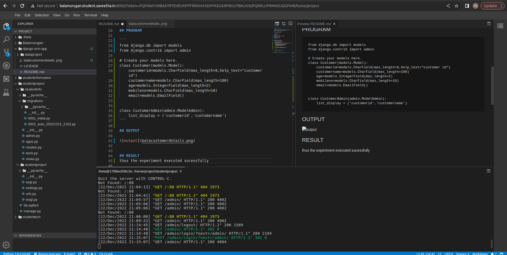

# Django ORM Web Application

## AIM
To develop a Django application to store and retrieve data from a database using Object Relational Mapping(ORM).

## Entity Relationship Diagram



## DESIGN STEPS

### STEP 1:
enter the python code
### STEP 2:
enter the customer details in django-orm
### STEP 3:
push the code to github
Write your own steps

## PROGRAM

```
from django.db import models
from django.contrib import admin

# Create your models here.
class Customer(models.Model):
    customerid=models.CharField(max_length=8,help_text="customer id")
    customername=models.CharField(max_length=100)
    age=models.IntegerField(max_length=2)
    mobileno=models.CharField(max_length=10)
    email=models.EmailField()


class CustomerAdmin(admin.ModelAdmin):
    list_display = ('customerid','customername')
```

## OUTPUT





## RESULT
thus the experiment executed sucessfully
